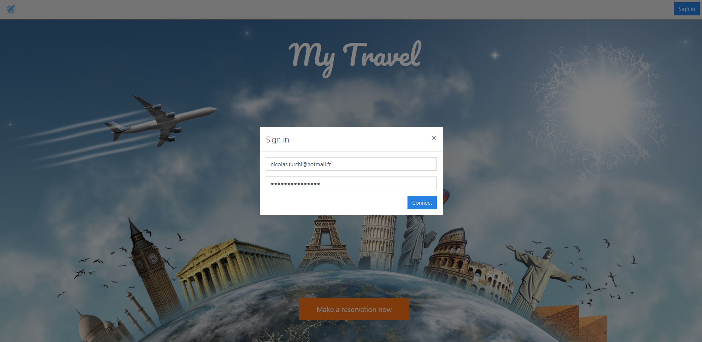

# MyTravel

This is a sample front-end application without back-end intergratio

# Preview 

## First page of the website


## Login modal


## Home page


# Others

This website has also a back-office page and a profile page. Feel free to try this project by executing this commands below (you must have nodeJs installed in your pc) :

``` npm install ```

``` npm install -g ng-cli```

``` ng build ```

``` node ./dist/index.js ```

## Routing

```localhost:3000/``` - Sign in page

```localhost:3000/home``` - Home page

```localhost:3000/admin``` - Back office page (in french) 